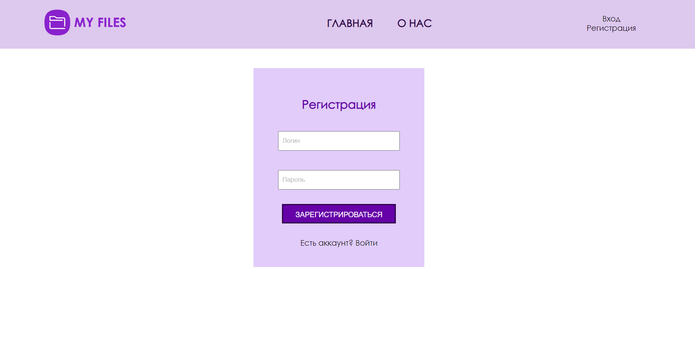
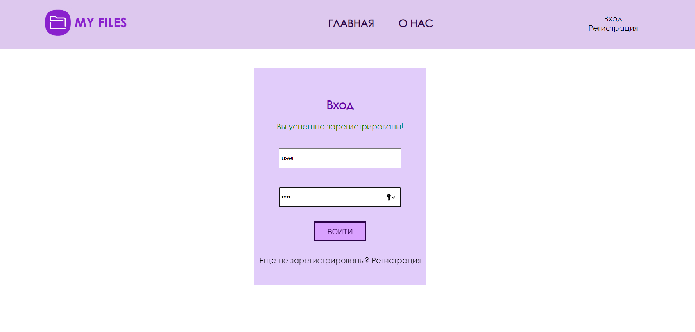
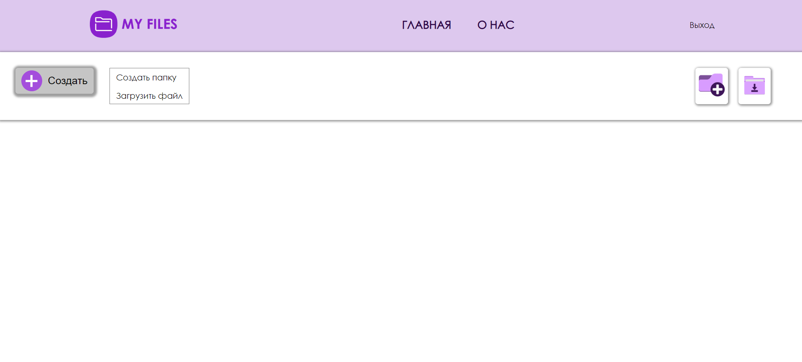
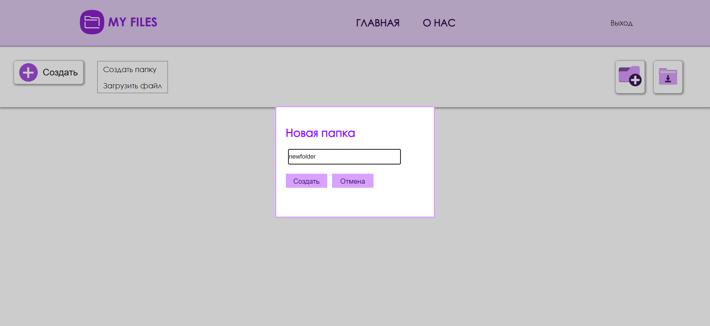
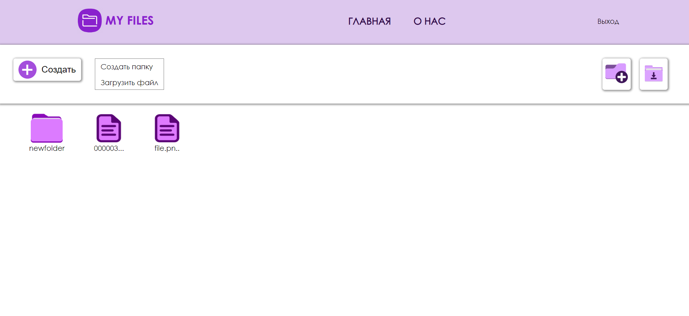
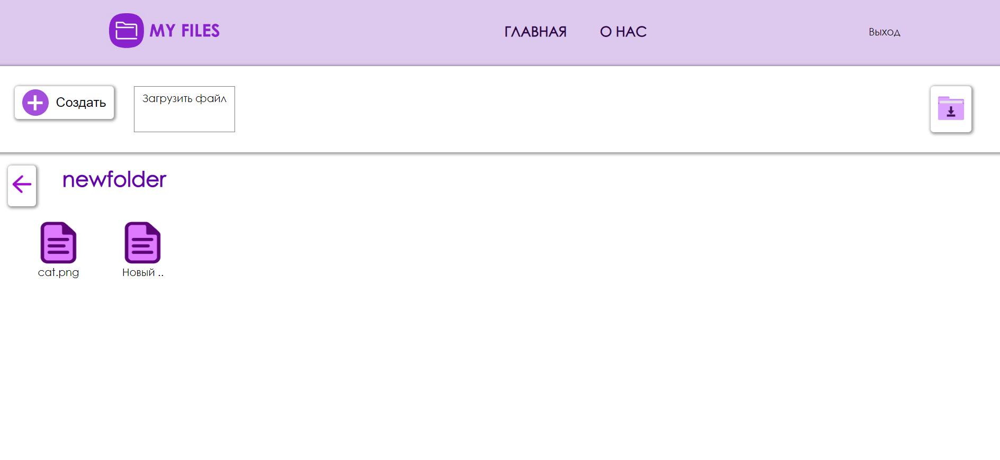

# Сервис для облачного хранения файлов React & Redux & Typescript

## Регистрация пользователя

***

## Авторизация

***

## Главная страница

Предусмотрена возможность создания папки с уникальным именем, а также загрузки и скачивания файлов

Просмотр содержимого папки

This section has moved here: [https://facebook.github.io/create-react-app/docs/advanced-configuration](https://facebook.github.io/create-react-app/docs/advanced-configuration)

### Deployment

This section has moved here: [https://facebook.github.io/create-react-app/docs/deployment](https://facebook.github.io/create-react-app/docs/deployment)

### `npm run build` fails to minify

This section has moved here: [https://facebook.github.io/create-react-app/docs/troubleshooting#npm-run-build-fails-to-minify](https://facebook.github.io/create-react-app/docs/troubleshooting#npm-run-build-fails-to-minify)
